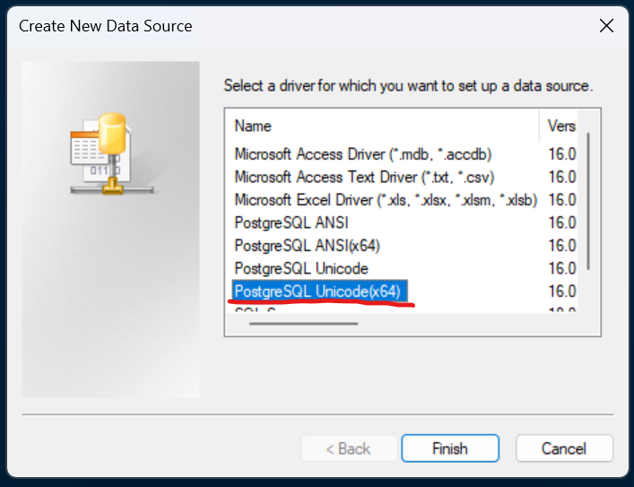
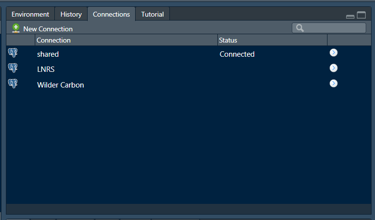

```{r, include = FALSE}
knitr::opts_chunk$set(
  collapse = TRUE,
  comment = "#>"
)
```

This package uses ODBC connections in functions that interact with the PostGIS database. These connections are saved to your local machine, avoiding the need to use the .Renviron and any reduce the risk that credentials can be accidentally shared. Each database you use will need an ODBC connection created by following these instructions.

### 1 - Download and install the PostgreSQL ODBC driver

The driver can be downloaded here: <https://www.postgresql.org/ftp/odbc/releases/REL-16_00_0005-mimalloc/>. You'll need to download the \_x64.msi file.

Extract the zip folder in your downloads and then double click on psqlodbc_x64.msi to open the setup wizard.

```{r out.width = '70%', echo = FALSE}
knitr::include_graphics("img/installer-start.png")
```

Use the next buttons to go through the wizard. You will need to agree to the liscence agreement. Then click 'install'.

Wait for the installation (you may need to click ok to let windows install the driver).

```{r out.width = '70%', echo = FALSE}
knitr::include_graphics("img/installer-wait.png")
```

### 2 - Set up an ODBC Data Source

When installation is complete, search 'ODBC' in the search box in your task bar. Click on the app called **ODBC Data Sources (64-bit)**.

```{r out.width = '70%', echo = FALSE}
knitr::include_graphics("img/find-odbc-app.png")
```

Go to the second tab called 'System DSN'. You probably won't have anything listed here yet! Click 'Add...' to open a smaller box.

```{r out.width = '70%', echo = FALSE}

```

Select the PostgreSQL Unicode(x64) driver. If this isn't listed, the installation wasn't successful. Click Finish to open yet another box.

```{r out.width = '70%', echo = FALSE}

```

Enter the details as follows:

-   Data Source: Choose a name for the connection. It's easiest to use the name of the database this connects to. In this example it's the database called 'shared'.
-   Description: Not really necessary. Leave blank.
-   Database: The name of the database. Usually this will be 'shared' as that's where most of the GIS data is.
-   SSL Mode: Set to 'prefer'.
-   Server: The host address of the server. This will be provided along with your database credentials.
-   Port: Set to 5432.
-   User Name: Your username which will be give to you.
-   Password: Also given to you.

```{r out.width = '70%', echo = FALSE}
knitr::include_graphics("img/connection-details.png")
```

Once you've entered all of that, click 'Test' to check it works. Then click 'Save'. The connection should now be listed under System Data Sources, so you can click 'OK' to close the ODBC Data Source Administrator.

### 3 - Connect to the Data Source in RStudio

Open RStudio and click on 'New Connection' in the Connections Pane.

```{r out.width = '70%', echo = FALSE}
knitr::include_graphics("img/new-connection.png")
```

You should be able to find your newly created ODBC data source in the box that opens up. Click on it and then make sure you choose 'Connect from: R Console'. Click OK.

```{r out.width = '70%', echo = FALSE}
knitr::include_graphics("img/choose-connection.png")
```

```{r out.width = '70%', echo = FALSE}
knitr::include_graphics("img/connection-settings.png")
```

Now you should see the database represented by a series of dropdowns for schemas and objects inside (tables, views and materialised views). You can choose to write SQL queries yourself by clicking the SQL button, though this package allows you to easily use the database without any need to write SQL yourself. Functions like `kwt::start_query` and `kwt::run_query` make use of the connection object created by the code chunk above. They can be combined with `{dplyr}` functions to make SQL queries that are run on the server, returning a data frame or spatial data frame. In those functions you may need to specify the connection object just created, in this example called `con`, however if you leave the name of the connection object as `db` then the functions in this package will use it without needing to explicitly include it as an argument.

```{r out.width = '70%', echo = FALSE}
knitr::include_graphics("img/db-list-rstudio.png")
```

RStudio now remembers the code chunk used to set up that connection and any others that you create. This means the connection is only a couple of clicks away from being made! There is also no risk of your database credentials being exposed in your code.

```{r out.width = '70%', echo = FALSE}

```
